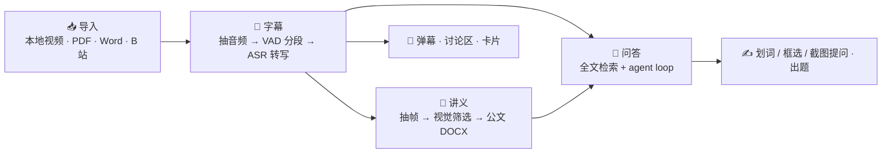
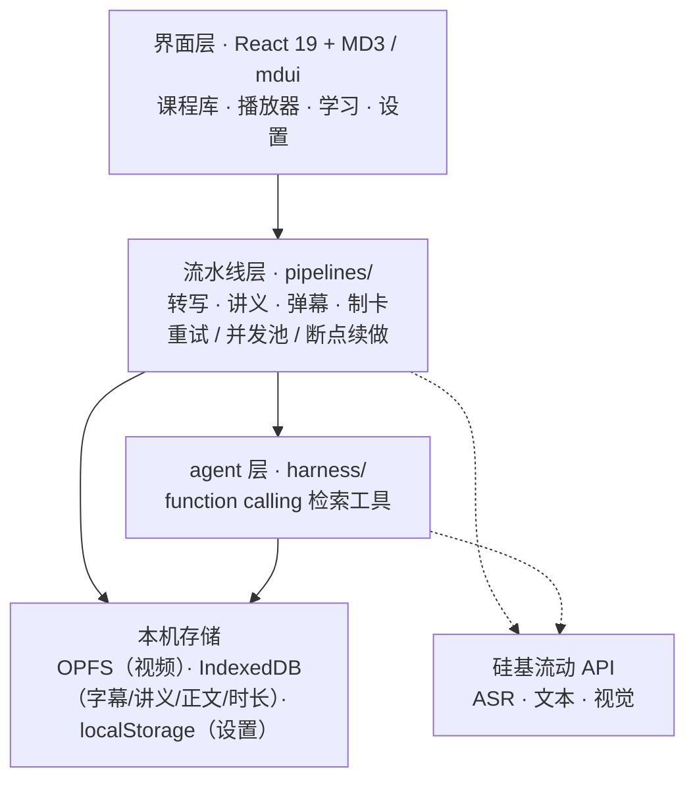
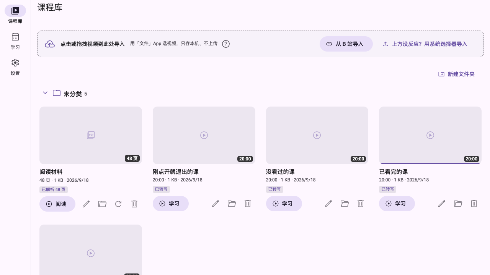
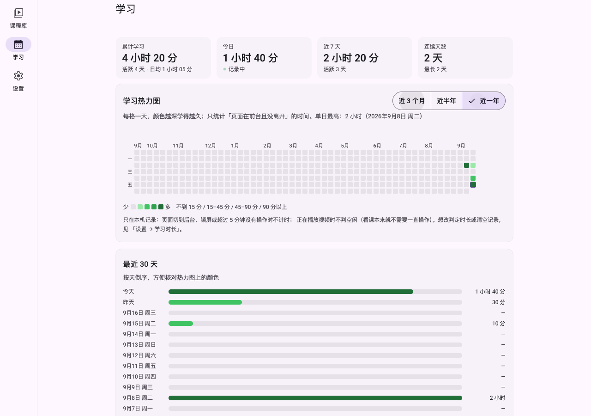

<div align="center">


# 网课学习助手

**把网课变成讲义。**

导入视频 / 阅读材料 → 本地转写字幕 → 生成公文格式讲义（DOCX）→ 基于课程内容问答

<br />


[快速开始](#-快速开始) · [使用指南](#-使用指南) · [开发流程](#-开发流程) · [功能一览](#-功能一览) · [参考](#-参考)

</div>

---

## ⚠️ 免责声明

本项目是**本地优先的个人学习工具**，仅供个人学习与研究使用。使用前请阅读以下几点：

1. **遵守平台协议** —— 视频导入（含 B 站通道）与字幕获取依赖第三方平台的公开接口。使用者须自行确保其使用方式符合该平台的用户协议与所在地法律法规。作者不支持、也不鼓励任何形式的批量抓取、绕过权限或内容再分发。
2. **尊重版权** —— 本项目不提供、不分发任何课程内容。请勿使用它下载或传播付费课程、会员专享及其他受版权保护的内容，由此产生的一切后果由使用者自行承担。
3. **数据不出本机** —— 视频、字幕、讲义与设置（含 API Key 与平台 Cookie）全部保存在浏览器本地存储中，作者不收集、不上传任何用户数据。分享导出文件前请先确认其中不含自己的凭据。**唯一例外是 HTML 材料**：按原文档渲染时会去取它自己引用的远程图片 / 样式 / 字体（见下方「HTML 材料」），设置页可一键关掉。
4. **API 费用自担** —— 转写、讲义与问答均调用第三方模型 API（默认硅基流动），产生的费用与账号风险由使用者承担。
5. **按原样提供** —— 本软件按「原样」提供，不附带任何明示或默示担保；因使用本软件造成的直接或间接损失，作者不承担责任。

> 开源许可（[MIT](LICENSE)）仅覆盖本项目自身的源代码，不覆盖任何第三方内容、模型权重或平台数据。

---

## 💡 这是什么

网课的痛点不在「没视频」，而在**视频不能检索、不能带走**。这门课你花 40 小时看完，一周后想找「当时讲的那个 Hook 执行时机」，只能拖进度条瞎找；想做笔记，就得手动暂停、抄写、排版。

这个工具把这条链路自动化：



**关键约束：全部在浏览器里跑，没有后端。** 视频存 OPFS、字幕与正文存 IndexedDB、设置存 localStorage，唯一出网的是发给模型 API 的文本与音频片段。所以它能装到 iPad 主屏、断网也能翻讲义。



---

## 🖼️ 界面

**课程库** —— 文件夹分组、封面、卡片底边的播放进度条



**学习** —— 一年热力图与时长统计



> 截图取自 e2e 测试的自播种数据，非真实课程内容。

---

## 🚀 快速开始

### 环境要求

| | |
|---|---|
| **Node.js** | 22+（两个代码生成器用 Node 原生剥类型直接读 `.ts`，需要 22.6+） |
| **API Key** | [硅基流动](https://cloud.siliconflow.cn/) 注册后申请，用于 ASR / 文本 / 视觉三类模型 |
| **浏览器** | Chrome / Edge / Safari。PWA 安装与离线需要 HTTPS 或 localhost |

### 跑起来

```bash
npm install
npm run dev        # http://localhost:5173（已带 --host，局域网可访问）
```

iPad 访问 `http://<Mac 的局域网 IP>:5173` 即可（同一 Wi-Fi）。

```bash
npm run build      # tsc -b + vite build → dist/
npm run preview    # 本地预览生产构建（端口 4173）
```

> [!WARNING]
> 非 localhost 的 `http://` 不是安全上下文：`crypto.randomUUID` 等 API 会缺失（代码里已降级，不会崩），但 **Service Worker / PWA 装不上**。要完整验证 PWA 行为，请走 HTTPS 托管。

### 首次配置（必做）

打开「设置」页（`/#/settings`）：

1. 填 **API Key** —— 只存本机 `localStorage`，不上传
2. 点 **「检查模型可用性」** —— 拉取模型列表，并逐个核对四个槽位是否还在架上
3. 三个槽位（ASR / 文本 / 视觉）默认值见 [默认模型](#默认模型)，可在「模型配置」里改
4. 「模型收藏夹」里勾选的模型会出现在各面板头部下拉中（面板级切换模型）

其余设置项都在同一页：字幕转写并发、问答检索轮次、上下文窗口、主题、动态取色、B 站导入通道、自定义倍速、学习时长、存储占用、数据迁移、写作技能。页面底部常驻一行「版本 · 构建时间 · commit」，用于排障。

### 部署

`dist/` 是纯静态产物，扔到任意静态托管即可。

> [!IMPORTANT]
> 应用依赖 `Cross-Origin-Opener-Policy` + `Cross-Origin-Embedder-Policy` 才能拿到 `crossOriginIsolated`（VAD 用 SharedArrayBuffer 多线程跑）。仓库里 `public/_headers` 已写好这两条。
>
> - **Netlify / Cloudflare Pages** —— 认 `_headers`，开箱即用
> - **Vercel** —— 需自己在 `vercel.json` 里配同样的 `headers`
> - **GitHub Pages** —— 不支持自定义响应头，VAD 退化为单线程（可用，只是慢）

```bash
npx serve dist          # Mac 上快速试，然后 iPad Safari 打开局域网 IP
```

iPad 上 **「分享」→「添加到主屏幕」**，得到独立窗口的 PWA，离线外壳才生效。

### 数据存在哪 / 什么情况下会丢

| 内容 | 位置 |
|---|---|
| 视频文件 | OPFS（流式写入，导入带进度） |
| 元数据 / 字幕 / 讲义 / 正文 / 学习时长 | IndexedDB（Dexie） |
| 设置 / API Key | `localStorage` |

> [!CAUTION]
> **清除站点数据 = 全部丢失**，没有云端副本。Safari 普通标签页里连续 7 天没打开，系统可能自动清理已导入的数据 —— 添加到主屏幕（PWA）可缓解。

---

## 📖 使用指南

按你想干的事找：

| 想做什么 | 去哪儿 |
|---|---|
| [导入课程](#导入课程) | 课程库首页 |
| [生成字幕](#生成字幕) | 播放页 → 字幕面板 |
| [生成讲义](#生成讲义) | 播放页 → 讲义面板 |
| [提问 / 出题](#提问--出题) | 播放页 → 问答面板 |
| [划词 / 框选提问](#划词--框选提问) | PDF、Word、字幕、讲义任意一处 |
| [弹幕](#弹幕) | 播放页 → 弹幕面板 |
| [讨论区（评论区）](#讨论区评论区) | 播放页 → 视频下方 |
| [卡片（Anki）](#卡片anki) | 播放页 → 卡片面板 |
| [播放器操作](#播放器操作) | 播放页 |
| [看学习时长](#学习时长) | 左侧导航「学习」 |
| [手机 / iPad 上怎么用](#移动端) | —— |
| [B 站导入怎么配](#b-站导入的两条通道) | 设置 → 哔哩哔哩导入 |

### 导入课程

课程库首页有三个入口：

| 入口 | 说明 |
|---|---|
| **投放区** | 点击或拖拽文件进来，支持多选，**顺序逐个**写入（避免并发写存储互相拖慢） |
| **从 B 站导入** | 粘贴链接 / BV 号 / `b23.tv` 短链 → 解析 → 勾选分 P 与自带字幕语言 → 下载并重封装为 mp4 |
| **新建文件夹** | 给视频分组 |

**支持格式**

- 视频：`mp4` `mov` `m4v` `webm` `mkv` `flv` `ts` `m2ts` `wmv` `avi` `mpg` `mpeg` `3gp` `rmvb` `rm`
- 阅读材料：**PDF**、**.docx**、**Markdown**（`.md` / `.markdown`）与 **HTML**（`.html` / `.htm`）。旧版 `.doc` 会明确提示「另存为 .docx」，不是静默忽略

导入之后：

- 视频卡片自动生成封面（抽帧里的幻灯片帧），底边按播放进度画进度条 —— **没看过、进度不足 1%、阅读材料都不画**；
- 阅读材料**写盘成功即算导入完成**，解析在后台跑，列表行上能看到 job 进度，不阻塞你继续导入下一个。

**HTML 材料**（[设计文档](docs/plans/2026-09-26-html-faithful-import-design.md)）

HTML 有两种读法，阅读器右上角可切，选择会记住：

| 视图 | 长什么样 | 适合 |
|---|---|---|
| **原样**（默认） | 整份文档塞进沙箱 iframe，**文档自己的 CSS 与版式照常生效** | 网页存档、带表格与配图的导出文档 |
| **分段** | 按语义块抽成「第 N 段」逐段排版，样式统一走应用的设计令牌 | 导航条噪音大、窄栏小字读不动的网页 |

两种视图共用同一套段号与同一个阅读位置，所以 `[第3段]` 引用、断点续读、划词提问在两边都成立。

> [!WARNING]
> **原样视图会联网。** 按原文档渲染意味着它引用的远程图片 / 样式表 / 字体会被加载 —— 这会向第三方暴露你的 IP，断网后同一份材料也长得不一样。默认开启，但**不静默**：阅读器顶部会常驻一条「正在联网加载 N 项资源」的提示并给一个「本次离线」按钮，设置页也有全局开关（关掉后完全离线，只放行文档内嵌的资源）。
>
> 两种情况下**脚本都不会执行**（沙箱不给 `allow-scripts`，CSP 里 `default-src 'none'` 兜底），相对路径的资源一律不解析（单文件导入下它们本来也没有对应文件），缺失数量会在提示条里说明。

### 生成字幕

播放页 → 面板「**字幕**」→「生成字幕」。

- 流程：本地抽音频 → VAD 分段 → 硅基流动 ASR 并发转写
- **边转边显**：每完成一段即时出现在字幕列表与画面字幕上，转写全程可播放
- **断点续做**：刷新 / 关页会中断任务，下次打开自动接着转（已完成段落已落库，不重复计费）
- 播放器内字幕轨 + 字幕列表点击跳转，可导出 **VTT / SRT**
- B 站视频若自带字幕，导入时可直接选用，不必走本地转写

### 生成讲义

「**讲义**」面板 → 生成。

- 自动抽帧 → 视觉模型筛选教学画面 → 模型输出结构化 IR → 渲染器按公文样式表统一排版
- 产出：封面 / 目录 / 页眉、A4 版式、仿宋正文黑体章节、单双页码、三线表、插图带章节号图注
- **DOCX 下载** + 网页预览。预览即文档效果 —— 公文字体本机有就用本机的（仿宋 / 楷体 / 黑体 / 宋体），没有则按需下载开源朱雀仿宋分包
- **块级编辑**：文字块左滑（移动端）或悬停（桌面）露出「AI 改写 / 编辑」。AI 改写有预设指令（更精简 / 更详细 / 更口语化 / 换个说法）与自由输入，先预览再接受；手动编辑可增删列表条目、弹窗改表格文字。改完从 IR 实时重建 DOCX
- 生成前会按课程内容**自动选用写作技能**（Skills），也可在面板里手动覆盖

### 提问 / 出题

「**问答**」面板。

| 能力 | 说明 |
|---|---|
| **检索问答** | 字幕 + 阅读材料的**全文检索（BM25）**，agent loop 流式回答；引用时间戳可点击跳播放器 |
| **截图提问** | 截图 + 时间轴上下文一起送模型，三级降级（多模态直读 → 视觉模型描述 → 拦截引导），明确**以图为准** |
| **画面引用** | 已有讲义抽帧时，模型可用 `[图@mm:ss]` 引用画面，气泡内渲染缩略图 |
| **出题** | 一键出题 / 对话式出题，生成可点选答题卡，点选即判、解析带时间戳、作答持久化 |
| **Mermaid 出图** | 回答里的 ```mermaid 围栏自动渲染成图，可看源码 / 复制 / 下载 SVG / 全屏 |
| **技能范围** | 工具条上的拼图按钮可**按会话限定**可用技能（默认全部）；限定后模型只能从勾选的技能里挑，工具层同步拦截 |
| **思考深度** | 低 / 高 / 最大可调，可控制思考过程是否显示 |

输入框下方有实时上下文用量；整会话可一键复制 Markdown / 导出 `.md`（含思考过程、题卡答案折叠与作答对错标记）。

检索走**全文匹配（BM25）**：把字幕与阅读材料的正文直接分词打分，不需要向量索引 —— 因此**没有 API Key 也能检索**（原来完全不能），也不存在「索引过期」这一整类问题。代价是**问句用词与原文不一致时会搜不到**，所以工具与提示词都要求模型传关键词、一次不中就换一组说法重试。

### 划词 / 框选提问

在 **PDF、Word、字幕、讲义**任意一处拖选文字，浮层即给「解释这段 / 就这段提问」；PDF 页面上还能切到「**框选**」态，圈出一块区域当图片提问（裁图规格与视频截图同构，复用同一条多模态降级链）。

引用以**可堆叠、可单条删除的引用条**落在输入框上方，随消息一起发给模型（先检索、再围绕引用作答）；用户消息气泡里「引的」与「问的」分区渲染。回答里的 `[第3页]` / `[第3段]` 可点击，阅读器滚到对应位置并高亮。

### 弹幕

「**弹幕**」面板 → 基于字幕生成 AI 思考题弹幕（启发式为主、回忆式为辅，宁缺毋滥）。

播放时自画面右侧向左侧飘过，恒定线速度（长句飘得久、短句不磨蹭）；暂停跟随暂停，seek 回退可重看；控制栏「弹」开关持久化；「弹幕」页可重新生成、点时间戳跳转。

### 讨论区（评论区）

**视频下方**一条「讨论区」折叠条 → 点开是一块 YouTube 式评论区：按课程内容生成的若干讨论串，每条锚定一个时间点，点时间戳跳回视频。

- **点开就有内容**：一键生成 AI 的「同学讨论」——每串 1 条主贴 + 1~3 条回复，围绕容易栽跟头的地方（常见误解、易错点、为什么非得这么规定、和相近概念怎么区分），不是知识点复述
- **两档排序**：热门（回复多的在前）/ 按进度（跟课程时间轴走）。**刻意没有「最新」**——内容是 AI 一次性生成的，按时间排等于随机
- **只读**：不做点赞、不做发帖。点赞在单机场景里是编出来的数字，排序改用「回复数」这个真实存在的量
- **默认折叠**：折叠条只占 44px。展开时播放器会让出高度，矮屏下也不会把视频或讨论区挤没
- 生成基于字幕，所以要先在「字幕」页出字幕；锚定的是「秒」，阅读材料页不出现（材料只有页/段）

> [!NOTE]
> 与「弹幕」的分工：弹幕是**一句话的随堂提问**（飘过画面、无回复）；讨论区是**围绕某个时间点的多轮讨论**（落在视频下方、可排序、可回复）。两者输入同源，但形态与用法都不同。

### 卡片（Anki）

「**卡片**」面板 → 从字幕提炼知识点生成候选卡（一卡一事实 / 自包含 / 答案唯一，带时间戳来源）→ **Tinder 式滑动审核** → 导出 `.apkg`。

| 操作 | 移动端 | 桌面 |
|---|---|---|
| 保留 | 右滑 | `→` |
| 丢弃 | 左滑 | `←` |
| 翻面 | 点击 | `空格` |
| 撤销 | 按钮 | `⌫` |

导出的 `.apkg` 是本地生成的 collection.anki2 旧版包，Anki 桌面 / AnkiMobile / AnkiDroid 均可导入；离线也能导出。

### 播放器操作

| 想做什么 | 怎么操作 |
|---|---|
| 倍速 | 控制栏倍速按钮（1 / 1.5 / 2 / 3x，窄屏折叠为循环按钮）；设置页可加自定义档位（0.25–4） |
| 快进 / 后退 10s | 双击画面左侧 / 右侧（涟漪反馈，连击累加） |
| 字幕字号 | 控制栏四档可调（持久化） |
| 影院模式 | 桌面控制栏点击影院按钮，隐藏右侧面板并让播放器铺满内容区；再次点击恢复分栏 |
| 跳到某句 | 点字幕列表任意一条 |
| 断点续播 | 自动记忆进度，重开接着播 |
| 不熄屏 | 长任务自动申请 Wake Lock |

### 学习时长

左侧导航「**学习**」页（`/#/study`）：一年热力图（53 周 × 7 天，四档绿，可切近 3 个月 / 近半年 / 近一年）+ 累计 / 今日 / 近 7 天 / 连续天数四张统计卡 + 最近 30 天明细。

> [!NOTE]
> 计时口径是「**页面在前台 + 没长时间离开**」，但**播放视频时不判空闲**（看课不需要一直操作键鼠）。空闲阈值在设置页「学习时长」卡片调（2 / 5 / 10 / 15 分钟），可关掉开关或清空记录。数据一天一行存 IndexedDB，只在本机。

### 移动端

- **≤640px 手机**：播放页变成「视频 + 全屏面板 + 底部 Tab 栏」（字幕 / 讲义 / 问答 / 弹幕 / 卡片）。面板用 `display:none` 保活，切换不丢草稿
- **手机横屏**：改为「左视频 / 右面板」左右分栏，切换条落在右栏顶部、默认停在「问答」，复刻桌面边看边聊的姿势
- safe-area 避让刘海与 Home 条；键盘弹出经 `interactive-widget` + `visualViewport` 同步收缩页面避免遮挡输入框；输入框 16px 防 iOS 聚焦缩放；触控目标 ≥40px

### B 站导入的两条通道

| 通道 | 何时用 | 怎么配 |
|---|---|---|
| **油猴桥**（推荐） | 桌面浏览器 | 装 [Tampermonkey](https://www.tampermonkey.net/) → 设置页「哔哩哔哩导入」点「安装脚本」→ 刷新页面。脚本挂在助手页上，用 `GM_xmlhttpRequest` 从**本机 IP** 直连 B 站 API / CDN（带 Referer、绕 CORS，不经过任何中转） |
| **自建代理**（回退） | 没有油猴时 | 部署 `cloudflare-worker/bili-proxy.js`（见 `cloudflare-worker/README.md`），把 `*.workers.dev` 地址填进设置页「代理地址」。Worker 出口 IP 常被 B 站拒绝，优先级低于油猴桥 |

清晰度：未登录通常只有 360P；在设置页粘贴自己账号的 Cookie 会带上登录态，清晰度随之取决于账号权限（**不破解任何限制**）。

> [!NOTE]
> iPad / 手机 PWA 装不了油猴，请改用本地文件导入，或在电脑浏览器里导好再同步。

---

## 🛠 开发流程

四步，顺序别换。

### 1️⃣ 设计文档先行

新功能先在 `docs/plans/` 写 `YYYY-MM-DD-主题-design.md`，文件头标状态（`已实现 / 进行中 / 已废弃`）：

| 小节 | 要写什么 |
|---|---|
| 背景与目标 | 现状是什么、要解决什么，以及**明确不做什么**（非目标） |
| 不变量 | 写错就会坏掉的硬约束（例：「构建时间必须是构建期常量，不是运行时值」） |
| 设计 | 方案本身，**含取舍**：为什么不用另一种做法、代价是什么 |
| 涉及文件 | 逐个列出新增 / 改动的文件及作用 |
| 验证 | 哪一层测什么、为什么这一层测得到 |
| 变更记录 | 日期 + 改了什么 + 为什么（含被推翻的假设） |

参考实现：`docs/plans/2026-09-18-build-info-design.md`。

### 2️⃣ 写代码

- **注释解释取舍**，不写代码复述。踩过的坑与被证伪的假设要留在注释里，否则下一个人会再踩一次
- **UI 一律走 MD3 / mdui 令牌**，不自造颜色与间距；组件从 `src/ui/` 的统一入口进，业务代码不要各自深链 `node_modules`
- **图标只改一个地方**：`src/ui/symbols.ts`（写 Material Symbols 官方 snake_case 名），然后**按顺序**重跑两个生成器：

  ```bash
  node scripts/gen-material-symbols.mjs   # 1 → src/ui/symbols.generated.ts
  node scripts/gen-mdui-types.mjs         # 2 → src/types/mdui-*.d.ts
  ```

  顺序不能反（第二个脚本要读第一个的清单才知道有哪些图标）。两个产物都是生成物，**勿手改**。升级 `mdui` 后重跑第二个即可。

### 3️⃣ 两层测试

<table>
<tr><th width="50%">第一层 · 纯逻辑 Node 单测</th><th width="50%">第二层 · 页面链路 Playwright e2e</th></tr>
<tr valign="top"><td>

`scripts/test-*.mjs`

- 不需要 API Key、不需要起服务，`node scripts/test-xxx.mjs` 直接跑
- 能脱离 DOM 的逻辑就抽成纯函数 —— 这是「能被测」的前提
- 例：`utils/studyLog.ts`（学习时长）、`materials/docx.ts`（Word 抽取，刻意与渲染分离）、`anki/apkgCore.ts`（.apkg 写入器核心）

</td><td>

`scripts/e2e-*.mjs`

- 真实浏览器跑真实链路；脚本自己造 fixture、自己播种 IndexedDB
- **必须登记进 `scripts/e2e-all.mjs` 的 `META`** —— 漏登记的后果是「脚本在，但一键跑分永远不执行它」，报告里也看不出少了什么
- `META` 每条要写清：`service`（`none` / `preview` 4173 / `dev` 5173）、`key`、`testFile`、`base`、`timeout`、`skip`（非空即跳过，**必须写明原因**）

</td></tr>
</table>

一键跑分：

```bash
node scripts/e2e-all.mjs                            # 无 key 全量（跳过硬依赖 SF_KEY 的脚本）
SF_KEY=sk-... node scripts/e2e-all.mjs --with-key   # 含真实 API 的全量
node scripts/e2e-all.mjs --only=e2e-import,e2e-mobile
node scripts/e2e-all.mjs --filter='^e2e-'
```

报告落在 `scripts/.cache/e2e-report.json` 与 `e2e-report.md`；有 failed 时退出码非 0。编排器自己负责启停 preview / dev 服务（端口已占用则复用），跑完只关自己启动的那个。

> [!NOTE]
> 诊断脚本（`debug-*` / `probe-*`）的输出仅供人工参考，但它们**并非总以 0 退出** —— 挂了同样算 failed 并让整轮变红。这是有意保留的：探针坏掉值得显式看见。

### 4️⃣ 交付前

```bash
npm run build            # 含 tsc -b，类型不过就不出产物
node scripts/e2e-all.mjs # 至少跑一遍无 key 档
```

> [!WARNING]
> **preview 档 e2e 跑的是当前 `dist/`，不是源码。** 改了源码要先 `npm run build`，否则验的是旧产物。`e2e-build-info` 会直接断言页面上的 commit 与仓库 HEAD 一致，专门抓这件事 —— 它红了先怀疑 `dist` 陈旧，而不是代码。

另外记得补 README：功能一览、目录结构、测试命令段。

**排障**：设置页最底部的「版本 · 构建时间 · commit」是构建期注入的常量。PWA 的 `autoUpdate` 会在后台更新 Service Worker 但**不刷新当前页面**，iPad 上遇到「改了怎么还是老的」时，靠这一行判断当前跑的是哪个构建（所以它带 commit 短哈希 —— 单独一个时间戳没有参照物）。

---

## ✨ 功能一览

| | 功能 | 一句话 |
|---|---|---|
| 📚 | **库与文件夹** | 文件夹分组、封面、卡片底边的播放进度条（没看过 / 不足 1% / 材料不画） |
| 📖 | **阅读材料** | PDF / Word / Markdown / HTML 导入后抽文本 → 分块，**与字幕同等参与检索**；HTML 可选「原样」或「分段」视图；扫描件显式告知 |
| ✍️ | **选区提问** | 划词 / 框选，引用条可堆叠可删除，`[第3页]` 可点击跳转 |
| 🎬 | **B 站导入** | 链接 / BV / 短链，油猴桥本机直连，DASH 重封装为 mp4（不重编码、不丢画质） |
| 📝 | **字幕** | VAD 分段 + ASR 并发转写，**边转边显**、断点续做，导出 VTT / SRT |
| 📄 | **讲义** | 抽帧 → 视觉筛选 → 公文 DOCX，结构化 IR + 块级编辑 + 公文字体还原 |
| 🧠 | **写作技能** | Agent Skills 规范，渐进式披露，内置 6 个技能，可导入 .md / zip |
| 💬 | **问答** | 全文检索（BM25）+ agent loop，Mermaid 出图、截图提问、画面引用、出题、技能范围、导出 .md |
| 🎯 | **弹幕** | 基于字幕生成思考题弹幕，飘过画面、开关持久化 |
| 🗣️ | **讨论区** | 视频下方的评论区：AI 生成同学讨论串、时间戳可点跳转、热门 / 按进度两档排序 |
| 🃏 | **卡片** | 字幕提炼 → Tinder 式滑动审核 → 导出 .apkg（Anki 全平台可导入） |
| 🎨 | **封面与动态取色** | 导入即抽帧生成封面；Material You 动态取色随课程变化 |
| ⏱️ | **学习时长** | 一年热力图 + 四张统计卡 + 30 天明细，只在本机 |
| 📱 | **PWA / 移动端** | 离线外壳、Wake Lock、横屏左视频右面板、safe-area 避让 |
| 🏷️ | **版本信息** | 设置页底部「版本 · 构建时间 · commit」，构建期注入，专治「改了怎么还是老的」 |

<details>
<summary><b>展开：各功能的实现细节</b></summary>

<br />

**库与文件夹** —— 首页视频按文件夹分组管理（新建 / 重命名 / 删除 / 折叠持久化，视频可移动归类，删文件夹视频回到未分类）；卡片缩略图底边显示播放进度条：看到一半的按比例画、看完的显示满条。没看过、以及进度不足 1% 的**不画** —— 不用 0 宽度的条冒充「看了一点」，那种精度下跟没看过本来也分不出来。

**阅读材料（PDF / Word / Markdown / HTML）** —— 除视频外还能导入 PDF、`.docx`、`.md` 与 `.html`（旧版 `.doc` 会明确提示「另存为 .docx」）。导入后走「抽文本 → 归一化分块」流水线，产出一份**带页码（PDF）或段落号（其余）定位**的文本索引，与字幕**同等参与问答检索**。PDF 用 pdf.js 渲染（连续滚动 + 视口窗口化渲染，300 页不卡）、Word 用 docx-preview 渲染、Markdown 走问答正文同一套渲染器；都支持位置导航、缩放、PDF 书签目录、断点续读。**扫描件会被显式识别并告知**（「没有文本层，无法参与检索，但仍可划词 / 框选提问」），不会让人误以为问答坏了。

**HTML 材料的两种读法** —— 「原样」把整份文档（含它自己的 `<style>`）净化后塞进**沙箱 iframe**，长得像原文档；「分段」按语义块抽成「第 N 段」逐段渲染。之所以不能直接插进主文档：导入文档的 CSS 里一条 `body{position:fixed}` 就能锁死整个界面，而 CSS 选择器无法安全地「作用域化」；Shadow DOM 挡得住样式泄漏，但 `position:fixed`、`html/body`、`@media`、独立滚动这些**视口相关**的规则仍按主文档算，一份为整页设计的文档塞进去必然错位。沙箱只给 `allow-same-origin`（**绝不给 `allow-scripts`**）—— 保留它的唯一目的是让父窗口读得到 `contentDocument`，划词、`[第N段]` 跳转、滚动定位全靠它；不给它则父窗口读不到 iframe 内部，这几件事全废。段号定位的做法是**不包装、只标注**：抽单元的同一个遍历顺手把 `data-mr-unit` 打回原 DOM，于是同一份文档既原样又可定位，段号与入库块同源同序（各写一份必然漂移，表现是 `[第3段]` 跳到第 5 段）。净化是三层：结构性黑名单（删脚本 / 表单 / `base` / `meta refresh` / 非 `stylesheet` 的 `link`）→ CSP（注入 head 首位，`default-src 'none'` 兜住漏网的加载）→ 沙箱。**相对路径资源一律拦住**：`srcdoc` 文档的 base URL 是宿主页面的 URL，`./bg.png` 会解析到应用自己的域名上，导入一份网页就等于给应用服务器发一堆 404。

**选区提问** —— 在 PDF、Word、字幕、讲义任意一处拖选文字，浮层即给「解释这段 / 就这段提问」；PDF 页面上还能切到「框选」态圈出一块区域当图片提问（裁图规格与视频截图同构，直接复用那条三级多模态降级链）。引用以**可堆叠、可单条删除的引用条**落在输入框上方，随消息一起发给模型（先检索、再围绕引用作答），用户消息气泡里也把「引的」与「问的」分区渲染。

**B 站导入** —— 优先走油猴脚本（Tampermonkey，`userscript/wangke-bili-bridge.user.js`）从本机直连 B 站 API / CDN（带 Referer、绕 CORS，不经过 Cloudflare）；没有脚本时才回退到自建代理。浏览器端用 mediabunny 把 DASH 音视频流重封装为 mp4（不重新编码、不丢画质），导入后与本地视频完全同权。

**字幕** —— 本地抽取音频 → VAD 分段 → 硅基流动 ASR 并发转写（断点续做，转写中边转边显），播放器内字幕轨 + 字幕列表点击跳转，可导出 VTT / SRT；播放进度自动记忆，重开断点续播；控制栏倍速快捷键、双击画面两侧 ±10s（涟漪反馈，连击累加）、字幕字号四档可调（持久化）。

**讲义** —— 内容层为结构化 IR：模型输出块级 JSON（主旨段 / 小节 / 列表 / 表格 / 配图 / 提示），排版样式由渲染器按样式表统一生成，编号全自动。插图**双轨抽帧**：VL 识图用 640px 低清（省 token），实际进文档的图按原视频 1600px/q0.92 定点重抽。网页预览经 @font-face 名字对齐还原公文字体：`local()` 优先命中各平台系统仿宋 / 楷体 / 黑体 / 宋体（含 PostScript 名变体），无公文字体的设备按需下载开源朱雀仿宋 woff2 分包（OFL，unicode-range 按真实 cmap 重算，SW CacheFirst 缓存）。

**写作技能** —— Agent Skills 规范（SKILL.md + references/），渐进式披露：讲义生成前由 LLM 路由按课程内容自动选用（讲义面板可按视频手动覆盖），问答 agent 通过 `use_skill` / `read_skill_reference` 工具按需加载正文与参考文档；**问答面板可按会话限定可用技能**（默认全部启用技能，限定后提示词清单与工具白名单同步收窄，模型调不到范围外的技能）；设置页可导入 .md 单文件或 zip 包，内置 6 个技能（公文讲义写作 / 公文版式规格 / 数学 / 编程 / 公考行测 / 公考申论，含 references）。

**问答** —— 字幕全文检索（BM25）+ agent loop（function calling 检索工具），流式回答。**Mermaid 出图**：懒加载引擎 + 串行渲染，未闭合围栏先挂起不抖，语法错回退源码 + 错误提示。**截图提问**：多图 + 时间轴上下文，三级降级，送模型时图与字幕上下文同时带且明确**以图为准**。**画面引用**：已有讲义抽帧时注册 `list_frames` 工具，agent 按画面描述选图并以 `[图@mm:ss]` 标记引用。**出题**：`present_quiz` 工具输出结构化题目，气泡内渲染可点选答题卡，点选即判、解析带时间戳跳转、作答状态持久化；解析按 Markdown 渲染，涉及流程 / 结构 / 对比时解析里的 ```mermaid 围栏直接出图（与问答正文同一条渲染链路），材料模式下不 linkify 时间戳以免死链。

**弹幕** —— 基于字幕一键生成 AI 思考题弹幕（启发式为主、回忆式为辅、宁缺毋滥），播放时自画面右侧向左侧飘过，走**恒定线速度**（思考题长度差好几倍，固定时长会让最长的那条飞得最快 —— 恰好最难读的最快）；暂停跟随暂停，seek 回退可重看；控制栏「弹」开关持久化；「弹幕」页可重新生成、列表点击时间戳跳转。

**讨论区（评论区）** —— 视频下方一条 44px 的折叠条，展开是 YouTube 式评论区：AI 按字幕生成若干讨论串（每串 1 主贴 + 1~3 回复），每串锚定一个字幕时间点。**与弹幕的差别是形态**：弹幕是一句话飘过、无回复；这里是围绕某个时间点的多轮对话，落在视频下方、可排序、可回复。排序只有两档 —— 热门（回复数降序）与按进度（时间轴升序）；**刻意没有 YouTube 的「最新」**（内容是 AI 一次性生成的，按生成时间排等于随机），**也没有点赞**（单机没有社交回路，编出来的数字会让人怀疑整块内容的真实性，热度改用「回复数」这个真实量）。折叠态占 44px，展开时 `.video-pane` 加 `video-pane--comments-open`，播放器按 `44vh` 的高度预算反推宽度让位（播放器高度由宽度决定，只能从宽度一侧压）—— 矮屏下视频与讨论区都不会被 `overflow:hidden` 裁掉。数据落 `comments` 表（v12），`parentId` 是非索引字段（一节课的评论本来就一次全取，内存里分组）。跨标签页迁移**不能走 `simpleTables` 快路径**：`parentId` 指向同表自增 id，剥掉 id 直接 `bulkAdd` 会让所有回复变成孤儿，导入侧按 `chatSessions→chats` 的做法重挂。模型输出解析 / 钳制 / 排序 / 两层分组全在 `harness/comments.ts`（零依赖，Node 可单测）。

**卡片（Anki）** —— 一键从字幕提炼知识点生成问答候选卡（一卡一事实 / 自包含 / 答案唯一，带时间戳来源）→ Tinder 式滑动审核 → 保留卡导出 .apkg（本地生成 collection.anki2 旧版包，Anki 桌面 / AnkiMobile / AnkiDroid 均可导入；sql.js 懒加载 + PWA 预缓存，离线可导出）。

**封面与动态取色** —— 导入后自动抽帧生成封面（小图档位存库、失败进队列回填、删除不残留）；可选 Material You 动态取色：从课程封面提取主色，让播放页配色随课程变化，取不到封面时回落默认配色。

**学习时长与热力图** —— GitHub 提交图样式的一年热力图（53 周 × 7 天，四档绿，悬浮 / 点按看当天时长，可切区间）+ 累计 / 今日 / 近 7 天 / 连续天数四张统计卡 + 最近 30 天明细。计时口径是「页面在前台 + 没长时间离开」，**播放视频时不判空闲**；数据一天一行存 IndexedDB（v11）。

**PWA** —— 添加到主屏幕离线可用外壳；长任务自动保持屏幕常亮（Wake Lock）；视频文件存 OPFS（流式写入、导入带进度），元数据 / 字幕 / 讲义存 IndexedDB。

**移动端** —— ≤640px 手机断点：播放页改为「视频 + 全屏面板 + 底部 Tab 栏」（display:none 保活切换不丢草稿）；手机横屏（矮 + 横）改为「左视频 / 右面板」左右分栏，默认停在「问答」。safe-area 避让刘海与 Home 条（横屏含左右边缘）；键盘弹出经 `interactive-widget` + visualViewport 同步收缩页面避免遮挡输入框（横屏下同时收窄视频，保证控制栏不被顶出可视区）；输入框 16px 防 iOS 聚焦缩放；触控目标 ≥40px；库页低频操作收进 ⋯ 菜单；讲义 DOCX 预览按屏宽等比缩放。

</details>

---

## 📦 参考

### 默认模型

硅基流动，设置页可改：

| 用途 | 模型 |
|---|---|
| ASR 转写 | `XingChenAGI/XingChenASR-V3.2-Ultra` |
| 文本生成 | `deepseek-ai/DeepSeek-V4-Flash` |
| 视觉 | `Qwen/Qwen3.6-35B-A3B` |

设置页可拉取模型列表并按用途收藏（供各面板下拉选用）；上下文窗口 / 多模态 / 思考能力来自 models.dev 实时元数据（本地缓存 7 天，设置页可手动刷新），未收录模型回退名称启发式，上下文窗口也可手动修改。

### 技术栈

| 层 | 用了什么 |
|---|---|
| 框架 | React 19 + Vite 5 + TypeScript |
| UI | **MD3 / mdui**（Web Components + 设计令牌，46 个自定义元素，类型由 `gen-mdui-types.mjs` 生成） |
| Markdown | @ant-design/x-markdown（流式渲染）· DOMPurify（模型直出 SVG 净化） |
| 播放与媒体 | Vidstack · mediabunny（抽音频 / DASH 重封装） |
| 音频与视觉 | @ricky0123/vad-web + onnxruntime-web（wasm 自托管） |
| 文档 | pdf.js（PDF 阅读器）· docx 公文排版 + docx-preview |
| 图表 | mermaid |
| 存储与状态 | Dexie(IndexedDB) · zustand · OPFS |
| 导出 | sql.js + fflate（.apkg） |
| PWA | vite-plugin-pwa |

> [!NOTE]
> 组件库已从 antd 迁到 mdui（`@ant-design/x-markdown` 作为流式 Markdown 渲染保留）；React 已升到 19。`e2e-mdui-adapter.mjs` 是这条迁移的守门员。

<details>
<summary><b>目录结构</b></summary>

<br />

```
src/
  api/          siliconflow.ts(OpenAI 兼容客户端，SSE + tool_calls) modelMeta.ts models.dev 元数据
                modelCaps.ts(能力查询)
  bilibili/     parse.ts api.ts pages.ts(分P) remux.ts(DASH→mp4) transport.ts(油猴桥优先/代理回退)
                subtitle.ts(自带字幕) dmview.ts(弹幕) wire.ts index.ts
  materials/    pdf.ts(pdf.js 封装/文本层/书签) docx.ts(Word 抽取，Node 可测) md.ts(Markdown 抽取)
                html.ts(HTML 整文档净化/段号锚点/字符集嗅探，与渲染分离) parse.ts(流水线)
                chunk.ts(归一化分块) units.ts(页/段引用) region.ts(框选裁图) types.ts material-reader.css
  harness/      agent.ts(循环) tools.ts context.ts prompts.ts search.ts(字幕检索)
                searchMaterial.ts(材料检索) quiz.ts ankiCard.ts comments.ts(讨论串清洗/排序/分组)
  pipelines/    transcribe.ts transcribeQueue.ts handout.ts handoutEdit.ts embedIndex.ts
                embedMaterial.ts materialJob.ts danmaku.ts cards.ts comments.ts cover.ts coverQueue.ts
  media/        audio.ts extractWorker.ts extractClient.ts vad.ts frames.ts(抽帧) wav.ts pcm.ts
                tolerantDecode.ts(坏帧容忍) snapshot.ts(截图) ortConfig.ts
  handout/      ir.ts(IR 类型/解析/兜底) styles.ts(版式样式表) render.ts(IR→排版) docx.ts(组装/补丁)
                previewFonts.ts(预览字体对齐)
  anki/         apkgCore.ts(写入器核心，Node 可测) apkg.ts(浏览器封装，sql.js 懒加载)
  skills/       types.ts builtin/(6 个内置技能) builtin.ts store.ts(升级/导入) router.ts(讲义路由)
                scope.ts(会话技能范围的三态判定，零依赖可单测) zip.ts
  components/   SubtitlePanel HandoutPanel HandoutDocView ChatPanel MaterialReader PdfReader DocxReader
                MdReader HtmlReader(沙箱 iframe 原样视图 + 分段视图)
                SelectionAsk mermaid/ QuizCard DanmakuPanel DanmakuLayer CardsPanel SwipeDeck
                CommentsSection(视频下方讨论区)
                SkillsCard StorageCard StudyTimeCard MigrationCard ModelPicker SkillPicker appNav.tsx motion.tsx
  pages/        Library(课程库) Player(播放) Study(热力图) Settings(设置)
  store/        db.ts(Dexie schema) settings.ts(zustand persist) studyTime.ts fileStore.ts(OPFS)
                storageStats.ts jobs.ts covers.ts subtitles.ts selectionAsk.ts migration.ts
  ui/           mdui.ts(注册元素/语言包/函数式 API) theme.ts layout.tsx panel.tsx
                symbols.ts(图标清单，只改这里) symbols.generated.ts(生成物) locale.ts feedback.ts
  types/        mdui-jsx.d.ts mdui-elements.d.ts（生成物，勿手改）
  utils/        studyLog.ts videoProgress.ts buildInfo.ts rate.ts cues.ts vtt.ts bilingual.ts
                linkify.ts chatExport.ts clipboard.ts concurrency.ts cancel.ts wakeLock.ts
                useMobile.ts errorText.ts format.ts
scripts/        playwright e2e（真实 API）+ Node 单测，见下「测试」
  fixtures/     make-pdf.py make-docx.mjs + 确定性样本
  gen-material-symbols.mjs / gen-mdui-types.mjs    代码生成器
cloudflare-worker/   B 站导入代理（油猴不可用时的回退）
userscript/          油猴桥：wangke-bili-bridge.user.js
public/              _headers(COOP/COEP) icon.svg ort/ vad/ fonts/
docs/plans/          设计文档（YYYY-MM-DD-主题-design.md）
docs/images/         README 用截图
```

</details>

<details>
<summary><b>测试命令</b></summary>

<br />

> `scripts/e2e-all.mjs` 的 `META` 是**权威清单**（脚本名 → 用哪个服务、要不要 key、超时多少）。下面这份是按用途整理的手工说明 —— 新增脚本请同步登记 META，否则一键跑分不会执行它。

**纯 Node 单测**（无需 API key / 无需起服务）

```bash
# B 站导入
node scripts/test-bilibili-parse.mjs      # 链接 / BV / 短链解析
node scripts/test-bilibili-api.mjs        # 接口封装（假 fetch）
node scripts/test-bilibili-transport.mjs  # 油猴桥优先 / 代理回退
node scripts/test-bilibili-index.mjs      # 文件名清洗
node scripts/test-bilibili-pages.mjs      # 分 P 与自带字幕
node scripts/test-bilibili-subtitle.mjs   # 字幕格式转换

# 讲义与问答
node scripts/test-handout-ir.mjs          # IR 解析 / 校验 / 兜底
node scripts/test-handout-prompts.mjs     # 提示词输出契约
node scripts/test-builtin-skills.mjs      # 内置 skill 资产（frontmatter / 预算 / references）
node scripts/test-chat-frames.mjs         # 画面引用：linkify / 清单格式化 / qaSystem 规则注入
node scripts/test-chat-export.mjs         # 会话导出 Markdown：结构 / 折叠块 / 题卡作答 / 文件名清洗
node scripts/test-qa-skill-scope.mjs      # 问答技能范围：undefined / [] / [id] 三态、白名单×启用集合求交、工具放行条件
node scripts/test-lexical.mjs             # 词法检索：分词（CJK 单字+二字组）/ BM25 打分 / 覆盖率加成 / 排序稳定
node scripts/test-db-schema.mjs           # Dexie 建表版本：v13 删两张向量表（含 v12 带数据升级的路径）
node scripts/test-quiz.mjs                # 答题卡：present_quiz 参数校验 / 清洗
node scripts/test-anki-cards.mjs          # 制卡：LLM 输出清洗 / 时间戳钳制 / 去重
node scripts/test-comments.mjs            # 讨论区：讨论串解析 / 角色与作者归一 / 钳制 / 去重 / 两档排序 / 两层分组（含孤儿回复）
node scripts/test-apkg.mjs                # .apkg 生成：zip + SQLite 结构断言

# 阅读材料
node scripts/test-material-units.mjs      # 页 / 段引用标记：格式化 / 反解 / linkify 往返 / 代码块不动
node scripts/test-material-chunk.mjs      # 归一化与分块：中文空格修正 / 软换行拼接 / 扫描件判定 / 长页再切
node scripts/test-material-docx.mjs       # Word 抽取：段落 / 表格 / 三种标题写法 / section 归属 / 真 zip 解包
node scripts/test-material-md.mjs         # Markdown 抽取：围栏整段保留 / 三种标题 / 段号与 section
node scripts/test-material-html.mjs       # HTML：整文档净化 / CSP 逐字 / 段号锚点同源同序 / 沙箱同源假设 /
                                          #       字符集（GB2312 不乱码）；自己起 headless Chromium，不起服务
node scripts/test-material-region.mjs     # 框选区域：矩形规范化 / 误触判定 / 选区清洗与截断

# 其它纯逻辑
node scripts/test-study-log.mjs           # 学习时长：本地日期键（UTC 陷阱）/ 跨零点切分 / 热力图几何 / 连续天数
node scripts/test-video-progress.mjs      # 主页进度条：null 时长 / finished 优先 / 1% 阈值两侧
node scripts/test-build-info.mjs          # 构建信息：时间补零 / 本地时区（不是 UTC）/ commit 缺失降级
node scripts/test-rate.mjs                # 倍速：归一化 / 档位比较 / 格式化
node scripts/test-pcm-resample.mjs        # 重采样契约：跨帧不丢相位（91 分钟短 7.6s 那个 bug 的守门员）
node scripts/test-ort-config.mjs          # ORT wasm 路径与单线程降级
node scripts/test-migration.mjs           # 旧数据迁移判定
node scripts/test-sync-units.mjs          # 同步单元：id 构造/解析往返 / 名字编码无歧义 / 分片边界 / 设置白名单与排除项互斥
node scripts/test-bilingual.mjs           # 双语字幕处理
node scripts/test-diagram-export.mjs      # 图表导出：只改根标签，不碰子元素几何
node scripts/test-error-text.mjs          # 错误文案归一
node scripts/test-library-job-copy.mjs    # 库页任务状态文案（转写 / 解析）
```

DOCX 渲染 XML 断言（需 esbuild 先打包）：

```bash
node_modules/.bin/esbuild scripts/render-handout-fixture.mjs --bundle --platform=node --format=esm \
  --packages=external --outfile=scripts/.cache/render-handout-fixture.mjs && \
  node scripts/.cache/render-handout-fixture.mjs
```

**e2e**（无需 API key，多数需先起服务）

```bash
# 高清抽帧（需 dev server；先造测试视频）
#   ffmpeg -y -f lavfi -i "testsrc2=size=1920x1080:rate=30" -t 10 -c:v libx264 -pix_fmt yuv420p public/.tmp-frames.mp4
npm run dev &
node scripts/e2e-frames-hires.mjs && rm -f public/.tmp-frames.mp4
node scripts/e2e-preview-fonts.mjs        # 讲义预览字体：local 链 / woff2 分包两条路径断言 + 截图

# 生产构建档（先 npm run preview 起 4173，或让 e2e-all 代管）
npm run preview &
BASE_URL=http://localhost:4173 node scripts/e2e-handout-edit.mjs   # 讲义块级编辑
BASE_URL=http://localhost:4173 node scripts/e2e-study.mjs          # 学习时长热力图（真等 80s 验计时与落库）
TEST_FILE=/path/to/lecture.mp4 node scripts/e2e-import.mjs          # 导入链路
TEST_FILE=/path/to/lecture.mp4 node scripts/e2e-resume.mjs          # 断点续播
TEST_FILE=/path/to/lecture.mp4 node scripts/e2e-player-enhance.mjs  # 倍速 / 双击 ±10s / 字幕字号
TEST_FILE=/path/to/lecture.mp4 node scripts/e2e-mobile.mjs          # 移动端 UI 全量
node scripts/e2e-library.mjs              # 首页交互：分组 / 移动 / 折叠 / 两步删除 / 拖拽
node scripts/e2e-library-progress.mjs     # 卡片进度条 + 实测填充宽度占比
node scripts/e2e-library-copy.mjs         # 长说明收进问号
node scripts/e2e-covers.mjs               # 封面：导入即有 / 小图档位 / PDF 首页 / 删除不残留
node scripts/e2e-materials.mjs            # 阅读材料链路：真实导入 PDF → 解析 → 阅读器 → 划词与框选 → 跳页
node scripts/e2e-cards.mjs                # 滑动制卡：审核 / 撤销 / 导出 .apkg
TEST_FILE=/path/to/lecture.mp4 node scripts/e2e-comments.mjs  # 视频下方讨论区：折叠 / 渲染 / 时间戳跳转 / 排序 / 让出高度 / 移动端
node scripts/e2e-chat-export.mjs          # 会话复制 / 导出 Markdown
node scripts/e2e-settings-skills.mjs      # 设置页写作技能列表 + 新建对话框
node scripts/e2e-storage-card.mjs         # 存储占用卡片
node scripts/e2e-build-info.mjs           # 构建信息注入链路 + commit 对得上仓库 HEAD
node scripts/e2e-mdui-adapter.mjs         # mdui 基建验收（React 19 / 46 个自定义元素 / 设计令牌）

# 需要 dev 档（要从模块 URL 拿应用同一份 Dexie 实例）
BASE_URL=http://localhost:5173 node scripts/e2e-chat-mermaid.mjs   # 问答 Mermaid 渲染
BASE_URL=http://localhost:5173 node scripts/e2e-quiz-mermaid.mjs   # 题卡解析出图
node scripts/e2e-chat-skill-scope.mjs     # 问答技能范围：勾选 / 持久化 / 全选归一化 / 换会话归位（自播种字幕）
node scripts/e2e-live-subs.mjs            # 增量字幕：边转边显与下游门控
node scripts/e2e-danmaku.mjs              # 弹幕链路：飘屏 / 开关持久化 / seek 重发
node scripts/e2e-bg-transcribe.mjs        # 后台转写：任务外置 / 续跑
node scripts/e2e-audio-corrupt-frame.mjs  # 抽音频坏帧容忍（自造损坏样片，不依赖常驻服务）

# 需要真实 API（SF_KEY）
SF_KEY=sk-... TEST_FILE=/path/to/lecture.mp4 node scripts/e2e-smoke.mjs        # 字幕链路
SF_KEY=sk-... TEST_FILE=/path/to/lecture.mp4 node scripts/e2e-handout.mjs      # 讲义链路
SF_KEY=sk-... TEST_FILE=/path/to/lecture.mp4 node scripts/e2e-chat.mjs         # 问答链路
SF_KEY=sk-... TEST_FILE=/path/to/lecture.mp4 node scripts/e2e-chat-image.mjs   # 截图提问链路
SF_KEY=sk-... TEST_FILE=/path/to/lecture.mp4 node scripts/e2e-chat-frames.mjs  # 画面引用链路
SF_KEY=sk-... TEST_FILE=/path/to/lecture.mp4 node scripts/e2e-quiz.mjs         # 出题题卡链路
```

</details>

### 已知限制

- 转写接口单文件 **≤ 1 小时、≤ 50MB**
- 讨论区的「同学讨论」是 AI **生成**的，不是真人评论；质量取决于模型，与弹幕同源（都基于字幕），不适合当学习依据
- 问答检索是**全文（BM25）匹配**，不是语义检索：提问用词与课程原文对不上时可能搜不到（模型会换关键词重试，但用原文术语提问命中率最高）
- 视频 / 字幕 / 讲义只存在本机浏览器，清除站点数据会丢失
- iPad / 手机 PWA 装不了油猴脚本，B 站导入请用桌面浏览器或本地文件
- 静态托管若不支持自定义响应头（如 GitHub Pages），VAD 会退化为单线程
- 旧版本存 IndexedDB 的视频会在首次打开时自动迁移到 OPFS
- HTML 材料的**原样视图会联网**：按原文档渲染意味着加载它引用的远程图片 / 样式 / 字体，这会向第三方暴露你的 IP，断网后同一份材料也会长得不一样。设置页可全局关掉，阅读器里也能对当前这份点「本次离线」（详见上方「HTML 材料」）
- HTML 原样视图里**相对路径的图片只显示 alt 文字**（单文件导入没有同目录资源可解析），有几项缺失会在阅读器顶部提示条里说明

<div align="center">
<sub>数据只在本机 · 不上传任何服务器</sub>
</div>
